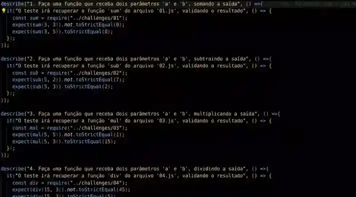

# nodejs-jest-ghactions_poc-eval-action

> pt-br

Esta é uma prova de conceito para avaliação automatizada de exercícios usando `NodeJS` + `Jest` + `Github Actions`.

Aqui, levando em consideração 5 exercícios, que devem ser construídos dentro da pasta `challenges` respeitando o formato `01.js; 02.js; 03.js; 04.js` (com exceção do 5º, que deve ser feito dentro da pasta `challenges/ex5`) _(Isso não é uma regra, mas pra efeitos de organização, utilizei essa disposição)_

Os exercícios são:

1. Faça uma função `sum` que receba dois parâmetros 'a' e 'b', somando a saída
2. Faça uma função `sub` que receba dois parâmetros 'a' e 'b', subtraindo a saída
3. Faça uma função `mul` que receba dois parâmetros 'a' e 'b', multiplicando a saída
4. Faça uma função `div` que receba dois parâmetros 'a' e 'b', dividindo a saída
5. Faça uma lista de afazeres simples com html, css e javascript
  - A página deve contér um form com um input e um botão de submissão, e fora dele, uma lista não ordenada, conforme data-test-id's:
    - `task-form`;
    - `input-task`;
    - `add-task`;
    - `task-list`.
  - O corpo da página (body) deve ter fundo azul (blue) e texto branco (white);
    - O primeiro parâmetro do `style.css` deve ser o `body`;
    - O primeiro atributo do `body` deve ser a cor de fundo;
    - O segundo atributo do `body` deve ser a cor de texto;
  - Sem atualizar a página, deve ser possível identificar itens adicionados à lista, quando o botão de submissão é acionado.

Para testar, crie uma PR, resolvendo os desafios, e aguarde a execução da ação para validar os exercícios. 
Ela vai aparecer no seu página do seu PR, na parte inferior, onde você pode acessar os detalhes para verificar o processo ([Exemplo com todos corretos](https://github.com/mjgargani/dnc-eval-action-poc/actions/runs/3714103159/jobs/6297564244#step:5:19) / [Exemplo com um exercício incorreto](https://github.com/mjgargani/dnc-eval-action-poc/actions/runs/3714096655/jobs/6297549598#step:5:19) / [Exemplo atualizado, incluindo o 5º exercício](https://github.com/mjgargani/dnc-eval-action-poc/actions/runs/3745900446/jobs/6360776354)).

Considerações importantes:

- É possível testar páginas Web utilizando uma biblioteca de testes E2E, chamada [Puppeteer](https://github.com/puppeteer/puppeteer), porém, esses testes tem mais custo em termos de tempo de execução (exercício 5);
- Existem várias formas de validar código, o contexto aqui, pensa em um teste de execução (então um problema pode ser resolvido de mais de uma forma), e não uma validação textual (o código está escrito certo/errado, baseado em um gabarito), como é feito com o teste de css no ex. 5;
- Existe um [custo de execução](https://docs.github.com/en/billing/managing-billing-for-github-actions/about-billing-for-github-actions) de ações no Github. Sugestões aqui:
  - Considerar um plano `GitHub Enterprise Cloud` para a instituição, caso esse metodo vá escalar de maneira interna (considerando que os desafios serão realizados dentro da própria organização);
  - De outra forma, orientar estudantes a fazer um `fork` do template do dia, e executar os testes em seus próprios repositórios (cada conta tem, **gratuitamente**, até 2000 minutos por mês (Dez/2022), para executar ações).
 
> en-us

This is a proof of concept for automated assignment assessment using `NodeJS` + `Jest` + `Github Actions`.

Here, taking into account 5 exercises, which must be built within the `challenges` folder respecting the `01.js format; 02.js; 03.js; 04.js` (with the exception of the 5th, which must be done within the `challenges/ex5` folder) _(This is not a rule, but for organizational purposes, I used this arrangement)_

The exercises are:

1. Make a `sum` function that takes two parameters 'a' and 'b', summing the output
2. Make a `sub` function that takes two parameters 'a' and 'b', subtracting the output
3. Make a function `mul` that takes two parameters 'a' and 'b', multiplying the output
4. Make a `div` function that takes two parameters 'a' and 'b', dividing the output
5. Make a simple to-do list with html, css and javascript
   - The page must contain a form with an input and a submit button, and outside of it, an unordered list, according to data-test-id's:
     - `task-form`;
     - `input-task`;
     - `add-task`;
     - `task-list`.
   - The body of the page must have a blue background and white text;
     - The first parameter of `style.css` must be `body`;
     - The first attribute of `body` must be the background color;
     - The second attribute of `body` must be the text color;
   - Without refreshing the page, it should be possible to identify items added to the list when the submit button is clicked.

To test, create a PR, solving the challenges, and wait for the action to be executed to validate the exercises.
It will appear on your PR page, at the bottom, where you can access the details to check the process ([Example with all correct](https://github.com/mjgargani/dnc-eval-action-poc/ actions/runs/3714103159/jobs/6297564244#step:5:19) / [Example with an incorrect exercise](https://github.com/mjgargani/dnc-eval-action-poc/actions/runs/3714096655/jobs /6297549598#step:5:19) / [Example updated, including the 5th exercise](https://github.com/mjgargani/dnc-eval-action-poc/actions/runs/3745900446/jobs/6360776354)).

Important considerations:

- It is possible to test Web pages using an E2E testing library, called [Puppeteer](https://github.com/puppeteer/puppeteer), however, these tests are more expensive in terms of execution time (exercise 5);
- There are several ways to validate code, the context here, think of an execution test (so a problem can be solved in more than one way), and not a textual validation (the code is written right/wrong, based on a template ), as is done with the css test in ex. 5;
- There is a [running cost](https://docs.github.com/en/billing/managing-billing-for-github-actions/about-billing-for-github-actions) of actions on Github. Suggestions here:
   - Consider a `GitHub Enterprise Cloud` plan for the institution, if this method will scale internally (considering that the challenges will be carried out within the organization itself);
   - Otherwise, guide students to fork the template of the day, and run the tests in their own repositories (each account has, **free of charge**, up to 2000 minutes per month (Dec/2022), to run actions).
